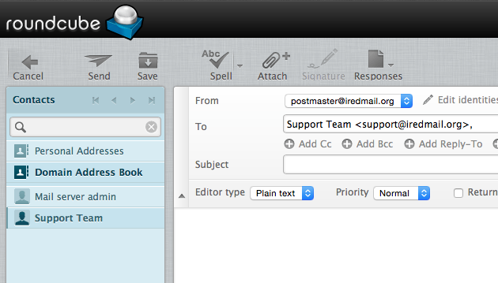
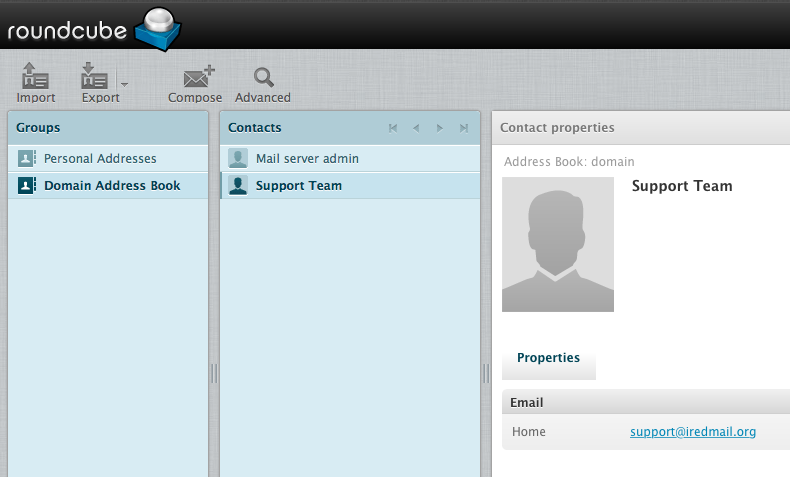

__If you have any other ideas, create an Issue in this github project.__

# RoundCube SQL Global Address Books
Roundcube Plugin to create an Address Book from list of users in the SQL View.
Currently Natively Supporting:
+ iRedMail [Aliases Supported]
+ [anything you create a MySQL View for (Check out SQL/README.md)]

By Default The `DomainBook` is enabled for all users. All other books will have to be configured prior to use.

# Screenshots

Compose new email:



Address Book view:



# License

This software adheres to the MIT License, please see LICENSE File!

# Installation

1. To Install, extract this archive and copy the folder
   `sql_global_addressbooks` into `roundcube/plugins/`

2. This plugin queries contacts from SQL VIEW (or table) `global_addressbook`,
   please check file `SQL/README.md` to understand how to create a required
   VIEW (or table). Available SQL templates:

    * For MySQL/MariaDB:

        * `iredmail+alias.my.sql`: template for iRedMail server.
          it will list both mail user and mail alias accounts in address book.
        * `iredmail.my.sql`: template for iRedMail server, it lists mail users
          in address book.

    * For PostgreSQL:

        * `iredmail.pg.sql`: template for iRedMail server. Note: it requires
          some manual setup, please open this file and read the comment first.

3. under `plugins/sql_global_addressbooks/`, copy `config.inc.php.dist` to
   `config.inc.php`. It will enable per-domain address book with default
   setting. if you need more control, please open it, read the commend, and
   adjust the settings to match your need.

4. Enable this plugin in Roundcube config file `roundcubemail/config/config.inc.php`.
   For example:

```php
$config['plugins'] = array(..., 'sql_global_addressbooks');
```

# Book Types

### Domain Book

This Book Type shows all users which are in the same Domain Realm as the Authenticated User.
Supports Whitelist and Blacklist to select which users are given this Book.

### Global Book

This Book Type shows all users, with the exception of the blacklisted ones.
Supports Whitelist and Blacklist of which domains to include in book, for example if you'd like to hide a domain from the Global Book then just add it to the `_sql_gb_data_hidden` array.
Supports Whitelist and Blacklist to select which users are given this book also.

### Support Book

This Book Type shows a specific set of domains, to all users except those which are part of any of the domains in the set.
This is the most complicated Book Type in the set, and probably won't get used, I do use it personally which is why its included.

# Security

This plugin is considered secure to use for the following reasons:

* Security through Obscurity - The plugin uses a MySQL View instead of directly accessing the SQL Schema+Table because it means it is given no access to such things as User Hashes [Passwords] but it also means that the whole Plugin remains the same and the View Defines how it interacts with the Existing DB.
* Read Only MySQL View - The View containing Functions and SubQueries [Alias Support] means that the View is Read Only which is another layer of security between your Data and any Potential Damaging Code.
* It uses the Internal Roundcube Address Book classes so if any bugs exist in them they will be patched accordingly, hopefully without breaking the functionality of this plugin.
* This plugin features no accessible endpoints, it can be Modelled as a processing node, as it does not address the client directly. Ever. All the communication between DB -> Itself -> Client is managed and administered by the RoundCube Plugin Hooks+API.

If you do not trust me, just look through the source code, it should be pretty straight forward and you can then rest assured!

# Support

The Configuration File has been annotated and should prove easy to understand.
Feel free to contact me directly at `postmaster _at_ webdevguru.co.uk` if you
have any queries or requests!
